---
## Front matter
title: "Отчёт по лабораторной работе 2"
subtitle: "Архитектура компьютера"
author: "Чермашенцев Павел Андреевич НБИбд-03-24"

## Generic otions
lang: ru-RU
toc-title: "Содержание"

## Bibliography
bibliography: bib/cite.bib
csl: pandoc/csl/gost-r-7-0-5-2008-numeric.csl

## Pdf output format
toc: true # Table of contents
toc-depth: 2
lof: true # List of figures
lot: true # List of tables
fontsize: 12pt
linestretch: 1.5
papersize: a4
documentclass: scrreprt
## I18n polyglossia
polyglossia-lang:
  name: russian
  options:
	- spelling=modern
	- babelshorthands=true
polyglossia-otherlangs:
  name: english
## I18n babel
babel-lang: russian
babel-otherlangs: english
## Fonts
mainfont: PT Serif
romanfont: PT Serif
sansfont: PT Sans
monofont: PT Mono
mainfontoptions: Ligatures=TeX
romanfontoptions: Ligatures=TeX
sansfontoptions: Ligatures=TeX,Scale=MatchLowercase
monofontoptions: Scale=MatchLowercase,Scale=0.9
## Biblatex
biblatex: true
biblio-style: "gost-numeric"
biblatexoptions:
  - parentracker=true
  - backend=biber
  - hyperref=auto
  - language=auto
  - autolang=other*
  - citestyle=gost-numeric
## Pandoc-crossref LaTeX customization
figureTitle: "Рис."
tableTitle: "Таблица"
listingTitle: "Листинг"
lofTitle: "Список иллюстраций"
lotTitle: "Список таблиц"
lolTitle: "Листинги"
## Misc options
indent: true
header-includes:
  - \usepackage{indentfirst}
  - \usepackage{float} # keep figures where there are in the text
  - \floatplacement{figure}{H} # keep figures where there are in the text
---

# Цель работы

Изучить идеологию и применение средств контроля версий.Приобрести практические навыки по работе с системой git.

# Порядок выполнения лабораторной работы

## Базовая настройка git

Сделал предварительную конфигурацию git.Открыл терминал и ввел команды, указав имя и электронную почту владельца репозитория
(рис. [-@fig:001])

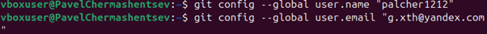{ #fig:001 width=70%, height=70% }

Настроил utf-8 в выводе сообщений git
рис. [-@fig:002])

{ #fig:002 width=70%, height=70% }

Задал имя начальной ветки(master)
рис. [-@fig:003])

{ #fig:003 width=70%, height=70% }

Ввел параметр autocrlf и safecrlf
рис. [-@fig:004])

{ #fig:004 width=70%, height=70% }

## Создание SSH ключа

Для следующий идентификации пользователя на сервера репозиториев сгенерировал пару ключей.(приватный и открытый)
(рис. [-@fig:005])

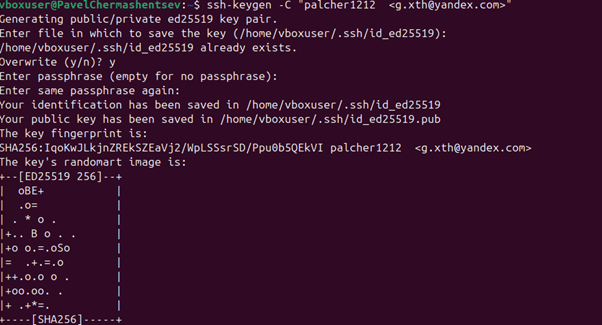{ #fig:005 width=70%, height=70% }

После генерации ключа загрузил открытый ключ ,скопировав из локальной консоли в 
буфер обмена. Вставил ключ в появившееся на сайте поле и указал 
для ключа имя(Title)(рис. [-@fig:006])

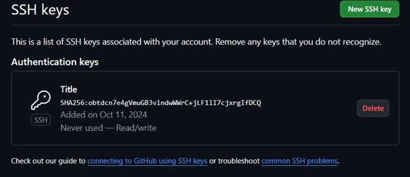{ #fig:006 width=70%, height=70% }

## Создание рабочего пространства и репозитория курса на основе шаблона

Открыл терминал и создал каталог для предмета “Архитектура компьютеров”
(рис. [-@fig:007])

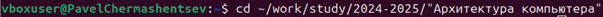{ #fig:007 width=70%, height=70% }

Создал репозиторий и задал имя
(рис. [-@fig:008])

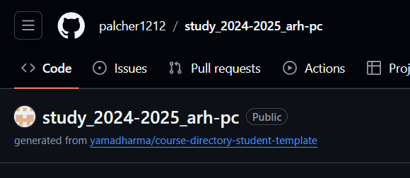{ #fig:008 width=70%, height=70% }

Открыл терминал и зашел в каталог курса.Клонировал созданный репозиторий.
(рис. [-@fig:009])

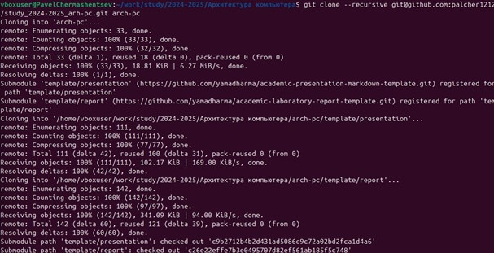{ #fig:009 width=70%, height=70% }

## Настройка каталога курса

Перешел в каталог курса
(рис. [-@fig:010])

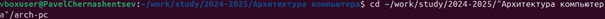{ #fig:010 width=70%, height=70% }

Удалил лишние файлы и создал необходимые каталоги.
(рис. [-@fig:011])

{ #fig:011 width=70%, height=70% }

Отправил файлы на сервер.
(рис. [-@fig:012]) (рис. [-@fig:013])

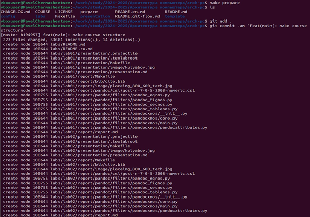{ #fig:012 width=70%, height=70% }

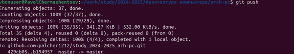{ #fig:013 width=70%, height=70% }

Проверил правильность создания иерархии рабочего пространства в локальном репозитории и на странице github.
(рис. [-@fig:014])

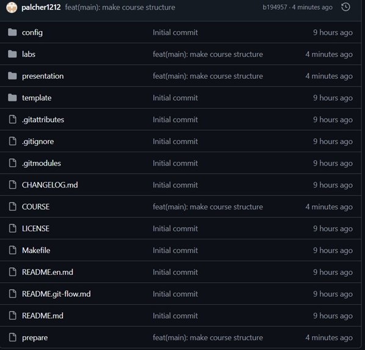{ #fig:014 width=70%, height=70% }

## Самостоятельная работа.

Добавил лабораторные в папки и загрузил на репозиторий.

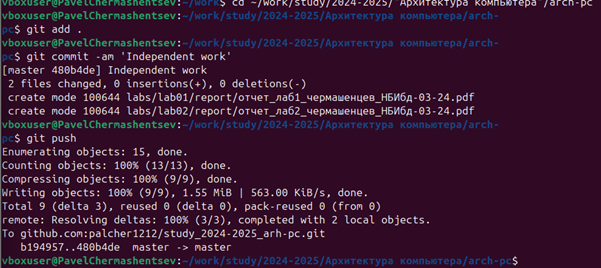{ #fig:015 width=70%, height=70% }

# Выводы

В ходе выполнения лабораторной работы я получил практические навыки работы с системой контроля версий Git. Я освоил основные команды, настроил рабочее пространство и репозиторий, а также успешно загрузил результаты на GitHub.
