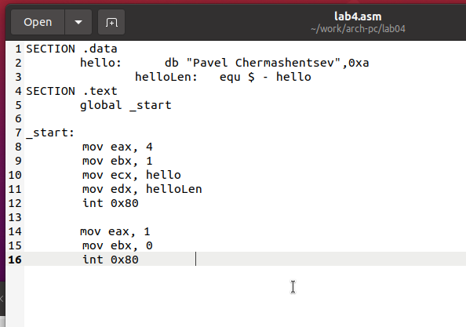

---
## Front matter
title: "Отчёт по лабораторной работе 4"
subtitle: "Архитектура компьютера"
author: "Чермашенцев Павел Андреевич НБИбд-03-24"

## Generic otions
lang: ru-RU
toc-title: "Содержание"

## Bibliography
bibliography: bib/cite.bib
csl: pandoc/csl/gost-r-7-0-5-2008-numeric.csl

## Pdf output format
toc: true # Table of contents
toc-depth: 2
lof: true # List of figures
lot: true # List of tables
fontsize: 12pt
linestretch: 1.5
papersize: a4
documentclass: scrreprt
## I18n polyglossia
polyglossia-lang:
  name: russian
  options:
	- spelling=modern
	- babelshorthands=true
polyglossia-otherlangs:
  name: english
## I18n babel
babel-lang: russian
babel-otherlangs: english
## Fonts
mainfont: PT Serif
romanfont: PT Serif
sansfont: PT Sans
monofont: PT Mono
mainfontoptions: Ligatures=TeX
romanfontoptions: Ligatures=TeX
sansfontoptions: Ligatures=TeX,Scale=MatchLowercase
monofontoptions: Scale=MatchLowercase,Scale=0.9
## Biblatex
biblatex: true
biblio-style: "gost-numeric"
biblatexoptions:
  - parentracker=true
  - backend=biber
  - hyperref=auto
  - language=auto
  - autolang=other*
  - citestyle=gost-numeric
## Pandoc-crossref LaTeX customization
figureTitle: "Рис."
tableTitle: "Таблица"
listingTitle: "Листинг"
lofTitle: "Список иллюстраций"
lotTitle: "Список таблиц"
lolTitle: "Листинги"
## Misc options
indent: true
header-includes:
  - \usepackage{indentfirst}
  - \usepackage{float} # keep figures where there are in the text
  - \floatplacement{figure}{H} # keep figures where there are in the text
---

# Цель работы

Целью работы является освоение процедуры компиляции и сборки программ, написанных на ассемблере NASM.

# Выполнение лабораторной работы

## Программа "Hello, World!"

В первую очередь создаю каталог `lab04` с помощью команды `mkdir`, после чего перехожу в него с помощью `cd` и создаю файл с именем `hello.asm`. (рис. [-@fig:001])

{ #fig:001 width=70%, height=70% }

Затем открываю созданный файл и реализую код программы согласно заданию. (рис. [-@fig:002])

{ #fig:002 width=70%, height=70% }

## Использование транслятора NASM 

Для трансляции файла использую команду `nasm`, в результате чего получаю объектный файл `hello.o`. (рис. [-@fig:003])

{ #fig:003 width=70%, height=70% }

Далее провожу трансляцию с дополнительными параметрами, что приводит к созданию файла листинга `list.lst`, объектного файла `obj.o`, а также к добавлению отладочной информации в программу. (рис. [-@fig:004])

{ #fig:004 width=70%, height=70% }

## Компоновка с помощью LD

Для компоновки использую команду `ld`, в результате чего получается исполняемый файл. (рис. [-@fig:005])

{ #fig:005 width=70%, height=70% }

Повторяю линковку для объектного файла `obj.o`, в результате чего создается исполняемый файл с именем `main`. (рис. [-@fig:006])

{ #fig:006 width=70%, height=70% }

Запускаю созданные исполняемые файлы для проверки их работы. (рис. [-@fig:007])

{ #fig:007 width=70%, height=70% }

## Выполнение заданий для самостоятельной работы

Копирую исходный код программы в новый файл.

Изменяю текст "Hello, World!" на свое имя (рис. [-@fig:008]) и запускаю измененную программу. (рис. [-@fig:009])

{ #fig:008 width=70%, height=70% }

{ #fig:009 width=70%, height=70% }

# Выводы

При выполнении данной лабораторной работы я освоил процесс компиляции и сборки программ, написанных на ассемблере nasm.
