---
## Front matter
title: "Отчёт по лабораторной работе 5"
subtitle: "Архитектура компьютера"
author: "Чермашенцев Павел Андреевич НБИбд-03-24"

## Generic otions
lang: ru-RU
toc-title: "Содержание"

## Bibliography
bibliography: bib/cite.bib
csl: pandoc/csl/gost-r-7-0-5-2008-numeric.csl

## Pdf output format
toc: true # Table of contents
toc-depth: 2
lof: true # List of figures
lot: true # List of tables
fontsize: 12pt
linestretch: 1.5
papersize: a4
documentclass: scrreprt
## I18n polyglossia
polyglossia-lang:
  name: russian
  options:
	- spelling=modern
	- babelshorthands=true
polyglossia-otherlangs:
  name: english
## I18n babel
babel-lang: russian
babel-otherlangs: english
## Fonts
mainfont: PT Serif
romanfont: PT Serif
sansfont: PT Sans
monofont: PT Mono
mainfontoptions: Ligatures=TeX
romanfontoptions: Ligatures=TeX
sansfontoptions: Ligatures=TeX,Scale=MatchLowercase
monofontoptions: Scale=MatchLowercase,Scale=0.9
## Biblatex
biblatex: true
biblio-style: "gost-numeric"
biblatexoptions:
  - parentracker=true
  - backend=biber
  - hyperref=auto
  - language=auto
  - autolang=other*
  - citestyle=gost-numeric
## Pandoc-crossref LaTeX customization
figureTitle: "Рис."
tableTitle: "Таблица"
listingTitle: "Листинг"
lofTitle: "Список иллюстраций"
lotTitle: "Список таблиц"
lolTitle: "Листинги"
## Misc options
indent: true
header-includes:
  - \usepackage{indentfirst}
  - \usepackage{float} # keep figures where there are in the text
  - \floatplacement{figure}{H} # keep figures where there are in the text
---

# Цель работы

Целью работы является приобретение практических навыков работы в Midnight Commander. 
Освоение инструкций языка ассемблера mov и int.

# Выполнение лабораторной работы

1. Открыл Midnight Commander и перешел в каталог ~/work/arch-pc. Создал новый каталог lab05 для работы.

   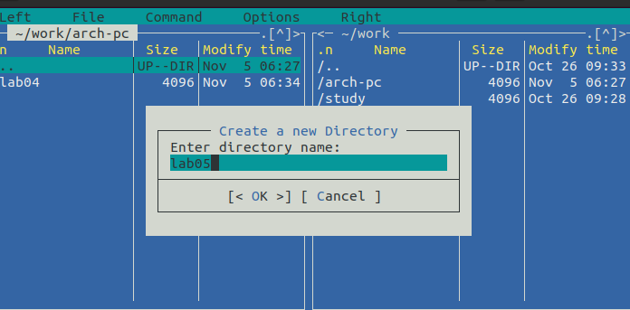{ #fig:001 width=70%, height=70% }

2. Создал файл lab05-1.asm, открыл его для редактирования и написал начальный код программы.

   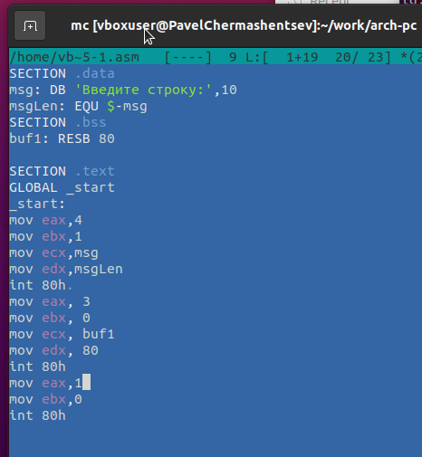{ #fig:002 width=70%, height=70% }

3. Открыл файл для просмотра и проверил корректность написанного кода.

   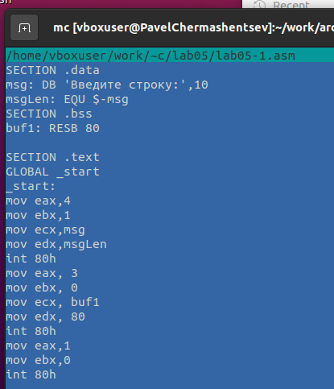{ #fig:003 width=70%, height=70% }

4. Скомпилировал файл и запустил полученный исполняемый файл, проверив его работоспособность.

   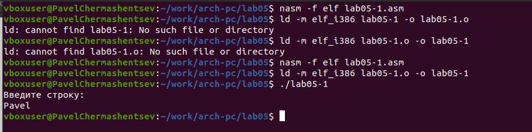{ #fig:004 width=70%, height=70% }

5. Скачал файл in_out.asm, добавил его в рабочий каталог. Скопировал файл lab05-1.asm и переименовал в lab05-2.asm.

   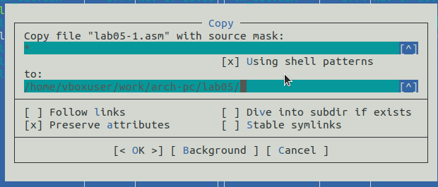{ #fig:005 width=70%, height=70% }

6. Написал код для программы lab05-2.asm, скомпилировал её и проверил корректность работы.

   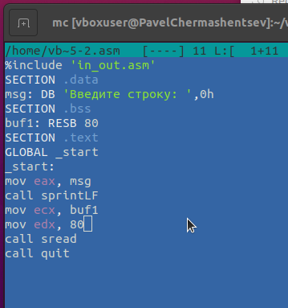{ #fig:006 width=70%, height=70% }

   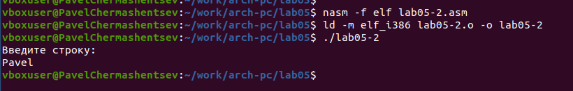{ #fig:007 width=70%, height=70% }

7. В файле lab05-2.asm заменил подпрограмму sprintLF на sprint. Пересобрал исполняемый файл. Теперь строка выводится без перехода на новую строку.

   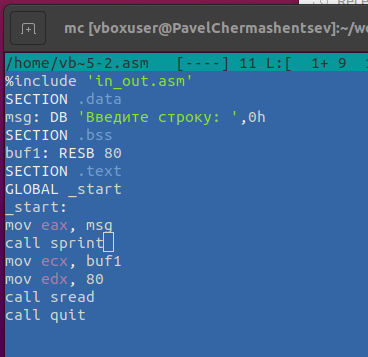{ #fig:008 width=70%, height=70% }

   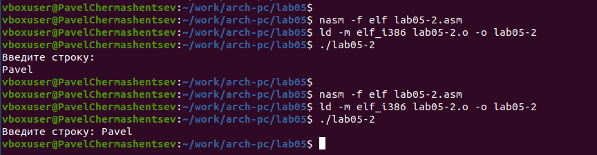{ #fig:009 width=70%, height=70% }

8. Скопировал программу lab05-1.asm и изменил код таким образом, чтобы:
   - Вывести приглашение типа “Введите строку:”.
   - Прочитать введённую строку с клавиатуры.
   - Вывести введённую строку на экран.

   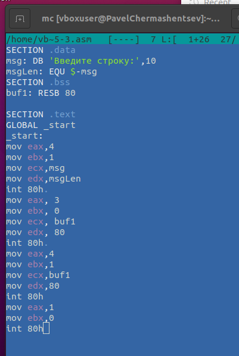{ #fig:010 width=70%, height=70% }

   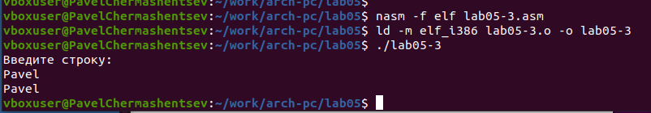{ #fig:011 width=70%, height=70% }

15. Скопировал программу lab05-2.asm и адаптировал её по аналогии с предыдущим заданием, используя возможности из файла in_out.asm.

   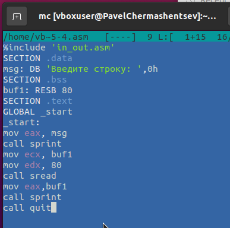{ #fig:012 width=70%, height=70% }

   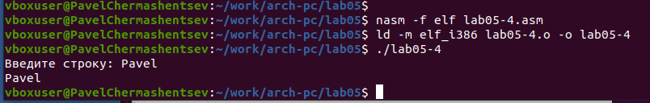{ #fig:013 width=70%, height=70% }

# Выводы

В ходе выполнения лабораторной работы были приобретены навыки написания базовых ассемблерных программ. Также освоены основные ассемблерные инструкции, такие как mov и int.
