---
## Front matter
title: "Отчёт по лабораторной работе 6"
subtitle: "Архитектура компьютера"
author: "Чермашенцев Павел Андреевич НБИбд-03-24"

## Generic otions
lang: ru-RU
toc-title: "Содержание"

## Bibliography
bibliography: bib/cite.bib
csl: pandoc/csl/gost-r-7-0-5-2008-numeric.csl

## Pdf output format
toc: true # Table of contents
toc-depth: 2
lof: true # List of figures
lot: true # List of tables
fontsize: 12pt
linestretch: 1.5
papersize: a4
documentclass: scrreprt
## I18n polyglossia
polyglossia-lang:
  name: russian
  options:
	- spelling=modern
	- babelshorthands=true
polyglossia-otherlangs:
  name: english
## I18n babel
babel-lang: russian
babel-otherlangs: english
## Fonts
mainfont: PT Serif
romanfont: PT Serif
sansfont: PT Sans
monofont: PT Mono
mainfontoptions: Ligatures=TeX
romanfontoptions: Ligatures=TeX
sansfontoptions: Ligatures=TeX,Scale=MatchLowercase
monofontoptions: Scale=MatchLowercase,Scale=0.9
## Biblatex
biblatex: true
biblio-style: "gost-numeric"
biblatexoptions:
  - parentracker=true
  - backend=biber
  - hyperref=auto
  - language=auto
  - autolang=other*
  - citestyle=gost-numeric
## Pandoc-crossref LaTeX customization
figureTitle: "Рис."
tableTitle: "Таблица"
listingTitle: "Листинг"
lofTitle: "Список иллюстраций"
lotTitle: "Список таблиц"
lolTitle: "Листинги"
## Misc options
indent: true
header-includes:
  - \usepackage{indentfirst}
  - \usepackage{float} # keep figures where there are in the text
  - \floatplacement{figure}{H} # keep figures where there are in the text
---

# Цель работы

Целью работы является освоение арифметических инструкций языка ассемблера NASM.

# Выполнение лабораторной работы

Создан каталог для программ лабораторной работы № 6, в который был добавлен файл `lab6-1.asm`.

Рассмотрим примеры программ, выводящих символьные и числовые значения. Эти программы будут выводить данные, записанные в регистр `eax`.

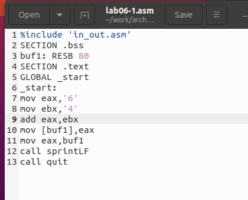{ #fig:001 width=70%, height=70% }

В данной программе (рис. [-@fig:001]) в регистр `eax` записывается символ '6' (команда `mov eax, '6'`), а в регистр `ebx` — символ '4' (команда `mov ebx, '4'`). Затем происходит сложение значений регистров `eax` и `ebx` (команда `add eax, ebx`), результат операции записывается в регистр `eax`. После этого выводится результат. Для использования функции `sprintLF` необходимо, чтобы в регистре `eax` находился адрес, поэтому используется дополнительная переменная. Значение регистра `eax` записывается в переменную `buf1` (команда `mov [buf1], eax`), а затем в регистр `eax` записывается адрес переменной `buf1` (команда `mov eax, buf1`), после чего вызывается функция `sprintLF`.

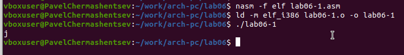{ #fig:002 width=70%, height=70% }

В случае, когда ожидаем получить число 10 при выводе содержимого регистра `eax`, фактический результат будет символ 'j'. Это объясняется тем, что код символа '6' в двоичном представлении равен `00110110` (54 в десятичном), а код символа '4' — `00110100` (52 в десятичном). При выполнении команды `add eax, ebx` результатом будет сумма этих кодов — `01101010` (106 в десятичном), что соответствует символу 'j' (рис. [-@fig:002]).

Далее изменяем программу, заменяя символы на числа (рис. [-@fig:003]).

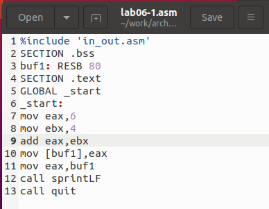{ #fig:003 width=70%, height=70% }

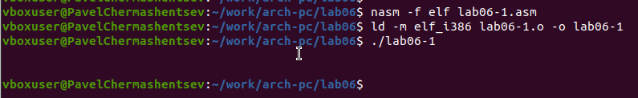{ #fig:004 width=70%, height=70% }

Как и в предыдущем примере, при выполнении программы мы не получаем число 10. Вместо этого выводится символ с кодом 10, который представляет собой символ конца строки (возврат каретки). Этот символ не отображается в консоли, но добавляет пустую строку.

Как упоминалось ранее, для работы с числами в файле `in_out.asm` реализованы подпрограммы для преобразования ASCII символов в числа и обратно. Преобразовал программу с использованием этих функций (рис. [-@fig:005]).

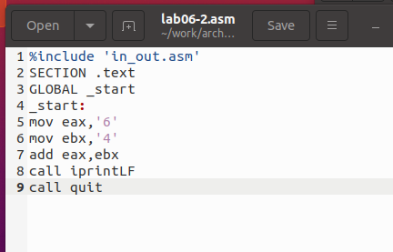{ #fig:005 width=70%, height=70% }

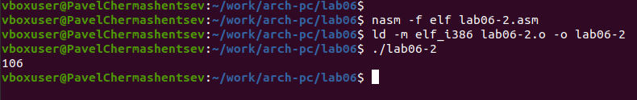{ #fig:006 width=70%, height=70% }

В результате выполнения программы выводится число 106 (рис. [-@fig:006]). В этом случае команда `add` суммирует коды символов '6' и '4' (54 + 52 = 106). Однако, в отличие от предыдущей программы, функция `iprintLF` позволяет вывести число, а не символ, который соответствует этому числу.

Аналогично предыдущему примеру изменяем символы на числа (рис. [-@fig:007]).

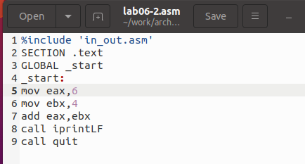{ #fig:007 width=70%, height=70% }

Функция `iprintLF` позволяет вывести число, и операндами являются числа, а не коды символов. Поэтому на экране будет выведено число 10 (рис. [-@fig:008]).

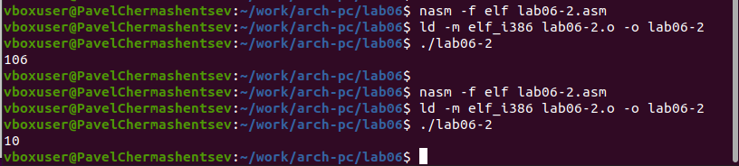{ #fig:008 width=70%, height=70% }

Заменил функцию `iprintLF` на `iprint`, создал исполняемый файл и запустил его. Вывод отличается тем, что теперь нет переноса строки (рис. [-@fig:009]).

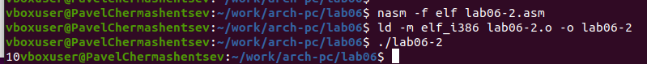{ #fig:009 width=70%, height=70% }

Для примера арифметических операций в NASM привожу программу для вычисления выражения (рис. [-@fig:010]) (рис. [-@fig:011]):

$f(x) = \frac{5 \times 2 + 3}{3}$.

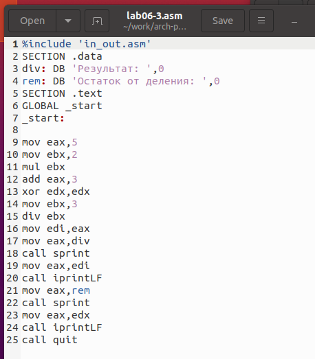{ #fig:010 width=70%, height=70% }

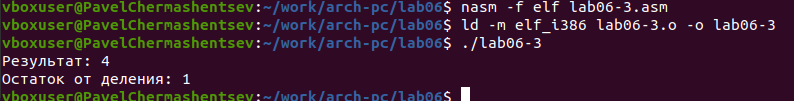{ #fig:011 width=70%, height=70% }

Изменил программу для вычисления выражения:

$f(x) = \frac{4 \times 6 + 2}{5}$.

Создал исполняемый файл и проверил его работу (рис. [-@fig:012]) (рис. [-@fig:013]).

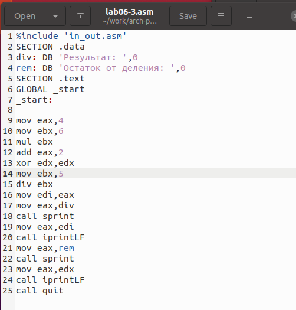{ #fig:012 width=70%, height=70% }

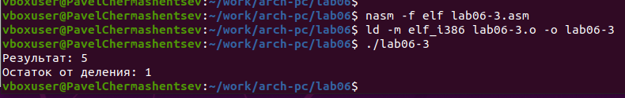{ #fig:013 width=70%, height=70% }

Рассмотрим еще один пример программы для вычисления варианта задания по номеру студенческого билета (рис. [-@fig:014]) (рис. [-@fig:015]).

В этом примере число, с которым нужно проводить арифметические операции, вводится с клавиатуры. Так как ввод осуществляется в виде символов, для корректной работы арифметических операций символы необходимо преобразовать в числа. Для этого используется функция `atoi` из файла `in_out.asm`.

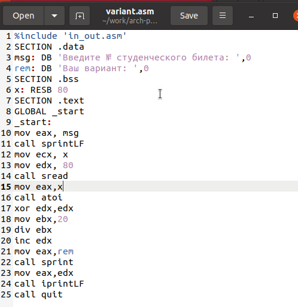{ #fig:014 width=70%, height=70% }

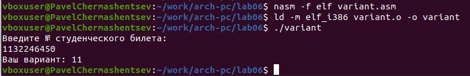{ #fig:015 width=70%, height=70% }

## Ответы на вопросы по программе variant.asm

1. **Какие строки листинга отвечают за вывод на экран сообщения «Ваш вариант:»?**

Строка `mov eax, rem` записывает в регистр значение переменной с фразой «Ваш вариант:», а строка `call sprint` вызывает подпрограмму для вывода этой строки на экран.

2. **Для чего используются следующие инструкции?**

- `nasm`: используется для компиляции кода на языке ассемблера NASM.
- `mov ecx, x`: перемещает значение переменной `x` в регистр `ecx`.
- `mov edx, 80`: перемещает значение 80 в регистр `edx`.
- `call sread`: вызывает подпрограмму для считывания значения студенческого билета с консоли.

3. **Для чего используется инструкция `call atoi`?**

Инструкция `call atoi` используется для преобразования введенных символов в числовой формат.

4. **Какие строки листинга отвечают за вычисления варианта?**

- `xor edx, edx`: обнуляет регистр `edx`.
- `mov ebx, 20`: записывает значение 20 в регистр `ebx`.
- `div ebx`: выполняет деление номера студенческого билета на 20.
- `inc edx`: увеличивает значение регистра `edx` на 1.

5. **В какой регистр записывается остаток от деления при выполнении инструкции `div ebx`?**

Остаток от деления записывается в регистр `edx`.

6. **Для чего используется инструкция `inc edx`?**

Инструкция `inc edx` увеличивает значение в регистре `edx` на 1, что соответствует формуле вычисления варианта.

7. **Какие строки листинга отвечают за вывод на экран результата вычислений?**

Строка `mov eax, edx` перекладывает результат вычислений в регистр `eax`, а строка `call iprintLF` вызывает подпрограмму для вывода этого результата на экран.

## Самостоятельное задание

Написана программа для вычисления выражения $ y = f(x) $. 
Программа выводит формулу для вычисления, запрашивает ввод 
значения $ x $, вычисляет выражение в зависимости 
от введенного $ x $ и выводит результат. 
В зависимости от лабораторного задания, 
был выбран вариант 11 — $ 10(x + 1) - 10 $ 
для $ x_1 = 1 $, $ x_2 = 7 $ (рис. [-@fig:016]) (рис. [-@fig:017]).

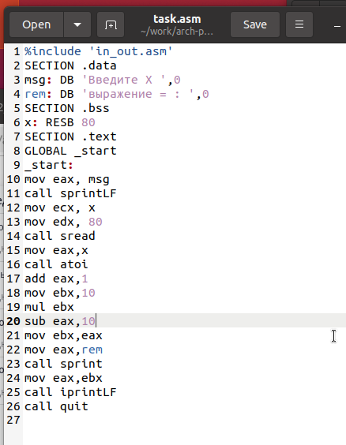{ #fig:016 width=70%, height=70% }

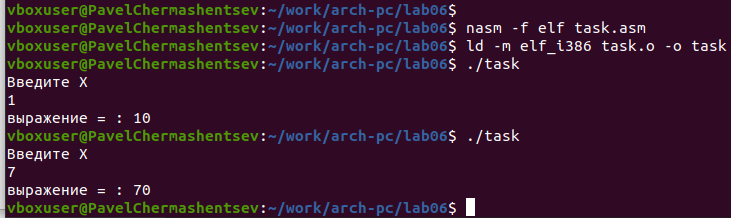{ #fig:017 width=70%, height=70% }

# Выводы

Изучили работу с арифметическими операциями.

